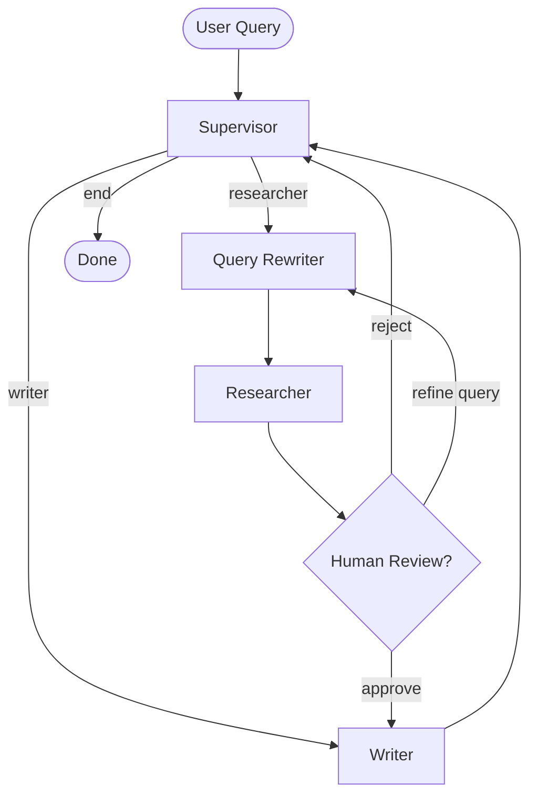

# Multi-Agent RAG — Human-in-the-Loop

A compact, production-oriented implementation of a Retrieval-Augmented Generation (RAG) pipeline driven by a team of cooperating agents (Supervisor, Researcher, Writer) with an optional human review node for validation and query refinement.

Highlights
- Multi-agent orchestration (Supervisor, Researcher, Writer) that routes work and shares a typed PipelineState.
- Local vector store (ChromaDB) with deterministic, idempotent ingestion of document chunks.
- Human-in-the-loop review node that lets an operator inspect retrieved context and approve, reject, or refine the query.
- Query rewriting to improve semantic search quality and optional re-ranking hooks.

Table of contents
- Features
- Architecture
- Quickstart
- Configuration
- Document ingestion (RAG setup)
- Running the CLI
- Human approval workflow
- Folder structure
- Example session
- Future improvements
- License

## Features
- Idempotent document ingestion into ChromaDB using HuggingFace sentence-transformers embeddings.
- Supervisor/Worker-style orchestration that keeps nodes small, testable, and composable.
- Query rewriter node to expand and normalize user queries for better recall.
- Simple console-friendly UI designed for Windows PowerShell / Command Prompt.

## Architecture

The project uses a small agent team to process a user query, retrieve supporting documents, optionally pause for a human review, and then synthesize a final, cited answer.



## Quickstart

Prerequisites
- Python 3.10+ recommended
- Git

1. Clone the repository

```bash
git clone https://github.com/ShreyGUPTA0924/Agentic-AI-Training.git
cd Agentic-AI-Training/assignments/task-02-multi-agent-rag
```

2. Create and activate a virtual environment

```bash
python -m venv .venv
# macOS / Linux
source .venv/bin/activate
# Windows (PowerShell)
.venv\Scripts\Activate.ps1
```

3. Install dependencies

```bash
pip install -r requirements.txt
```

## Configuration

Copy the environment template and provide any API keys required by your configuration:

```bash
cp .env.example .env
# then edit .env and add your API key(s)
```

The project expects a GROQ-style key variable (used by the optional query-rewriter LLM integration). If you do not use that component, you can leave the key empty and the core RAG flow will still function.

## Document ingestion (RAG setup)

Ingest your source documents into the local ChromaDB vector store. The ingestion script is idempotent and uses deterministic chunk IDs to avoid duplication.

```bash
python rag/ingest.py
```

This will process files under `data/documents/` and write vector data to `data/chroma_db/`.

## Running the CLI

Start the interactive CLI to ask questions against your local document collection:

```bash
python main.py
```

The system will orchestrate agents to rewrite the query (if enabled), retrieve top-k chunks from ChromaDB, pause for a human review (if configured), and then synthesize a final answer with citations.

## Human approval workflow

When the human review node is reached the CLI will display the retrieved chunks and prompt the operator with three options:
- `y` / `yes` — Approve the retrieved context and proceed to the Writer to generate the final answer.
- `n` / `no` — Reject the retrieved context. The Supervisor will determine whether to rerun the researcher or exit.
- `r <new query>` — Replace the query with `<new query>` and run retrieval again.

This simple interrupt-based pattern makes it easy to inspect and control the grounding sources before the model generates a response.

## Folder structure

```
assignments/task-02-multi-agent-rag/
├── README.md                    # This file
├── requirements.txt             # Python dependencies
├── .env.example                 # Template for environment variables
├── data/
│   ├── chroma_db/               # Persisted local Chroma vector store
│   └── documents/               # Source documents to index
│       ├── sample_ai.txt
│       └── sample_ml.txt
├── agents/
│   ├── supervisor.py            # Routing logic and Supervisor agent
│   ├── query_rewriter.py        # Optional LLM-based query rewriter
│   ├── researcher.py            # Issues similarity searches to ChromaDB
│   └── writer.py                # Synthesizes final, cited answers
├── rag/
│   ├── ingest.py                # Idempotent chunking + indexing script
│   └── retriever.py             # Chroma similarity search wrapper
├── state.py                     # Shared PipelineState typing
├── graph.py                     # LangGraph compilation and routing
└── main.py                      # Interactive CLI entry point
```

## Example session (abridged)

```
MULTI-AGENT RAG PIPELINE — HUMAN-IN-THE-LOOP

> Tell me about RLHF and reward models.

[Researcher] Retrieved 4 document chunks.
[HumanReview] Paused for human verification of retrieved context.

Options:
- y / yes  : Approve and proceed to Writer
- n / no   : Reject and return to Supervisor
- r <query>: Refine the query and search again

> y

[Writer] Generating final answer (with citations)...

Reinforcement Learning from Human Feedback (RLHF) is a technique used to align large language models with human preferences. The reward model scores candidate outputs based on human judgments, and the policy is updated accordingly.
```

## Future improvements
- Add a re-ranking node (cross-encoder/reranker) to select the most faithful chunks before synthesis.
- Add an evaluation node to measure faithfulness and factual grounding of generated answers.
- Provide a management CLI for clearing and versioning local vector collections.
- Expand automated tests for the LangGraph routing logic and human-review behaviors.

## License

MIT — see the LICENSE file at the repository root for details.
