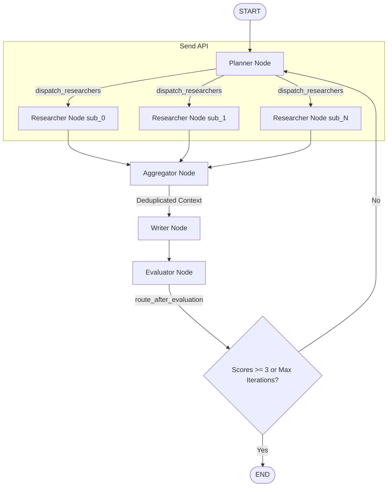

# Assignment Task 03 — Plan-and-Execute Agent with Parallel Workers, Self-Reflection, and FastAPI REST API

This project implements a production-grade Plan-and-Execute multi-agent system built using LangGraph, persisting state using `SqliteSaver` in SQLite, and exposing a REST API with real-time SSE (Server-Sent Events) streaming via FastAPI.

## 🗺️ Architecture Overview

The multi-agent pipeline is structured as a directed graph that supports dynamic planning, parallel document retrieval (fan-out/fan-in), synthesis, evaluation, and self-reflection feedback loops:



---

## ⚙️ Setup and Installation

### 1. Recreate and Activate Virtual Environment
```bash
# Verify base Python is 3.12 (as used in previous tasks)
python -m venv .venv
.venv\Scripts\activate
```

### 2. Install Dependencies
```bash
pip install -r requirements.txt
```

### 3. Environment Variables
Create a `.env` file in the task directory:
```env
# LLM Provider Key (Groq)
GROQ_API_KEY=your-groq-api-key-here

# Optional: LangSmith Tracing
LANGCHAIN_TRACING_V2=false
LANGCHAIN_API_KEY=your-langchain-api-key-here
LANGCHAIN_PROJECT=task-03-plan-execute-api
```

---

## 🚀 How to Run and Test

### 1. Ingest Documents
Place `.txt` or `.md` files in `data/documents/` (three sample files are included by default: `vector_db.txt`, `langgraph_send.txt`, and `prompt_engineering.txt`). Run the CLI with the `--re-ingest` flag or run `rag/ingest.py` to index them:
```bash
python rag/ingest.py
```

### 2. Local CLI Testing
Run the command-line interface to execute queries:
```bash
python main.py --query "What is the Send API and how is deduplication handled in the aggregator?" --thread-id cli_test_session
```

### 3. Start the FastAPI API Server
Start the development server using Uvicorn:
```bash
uvicorn api.server:app --reload --port 8000
```

---

## 🔌 REST API Endpoints

### 1. POST `/research`
Initiates a research session and returns a real-time event stream (`text/event-stream`).

**Request Example:**
```bash
curl -X POST "http://localhost:8000/research" \
     -H "Content-Type: application/json" \
     -d "{\"query\": \"How do vector databases handle search, and how does the Send API enable dynamic parallel worker executions?\", \"thread_id\": \"api_test_thread\", \"max_iterations\": 3}"
```

**Response Stream Output Example:**
```
data: {"type": "planner", "sub_tasks": [{"id": "sub_0", "question": "How do vector databases handle similarity search and algorithms used"}, {"id": "sub_1", "question": "How does LangGraph Send API enable dynamic parallel executions"}]}

data: {"type": "researcher", "sub_task_id": "sub_0", "chunks_found": 4}

data: {"type": "researcher", "sub_task_id": "sub_1", "chunks_found": 4}

data: {"type": "aggregator", "total_chunks": 8, "after_dedup": 6}

data: {"type": "writer", "draft_length": 1542}

data: {"type": "evaluator", "faithfulness": 5, "relevance": 5, "iteration": 1}

data: {"type": "final", "answer": "Vector databases utilize high-dimensional vector embeddings to index documents... The Send API in LangGraph enables parallel fan-out..."}
```

### 2. GET `/research/{thread_id}`
Retrieves the latest checkpointed state for an existing search query session.

**Request Example:**
```bash
curl "http://localhost:8000/research/api_test_thread"
```

**Response Example:**
```json
{
  "status": "complete",
  "state": {
    "original_query": "How do vector databases handle search...",
    "sub_tasks": [...],
    "aggregated_context": [...],
    "draft": "Vector databases utilize high-dimensional vector embeddings...",
    "evaluation": {
      "faithfulness": 5,
      "relevance": 5,
      "feedback": "Perfect cited response."
    },
    "iteration": 1,
    "max_iterations": 3
  }
}
```
